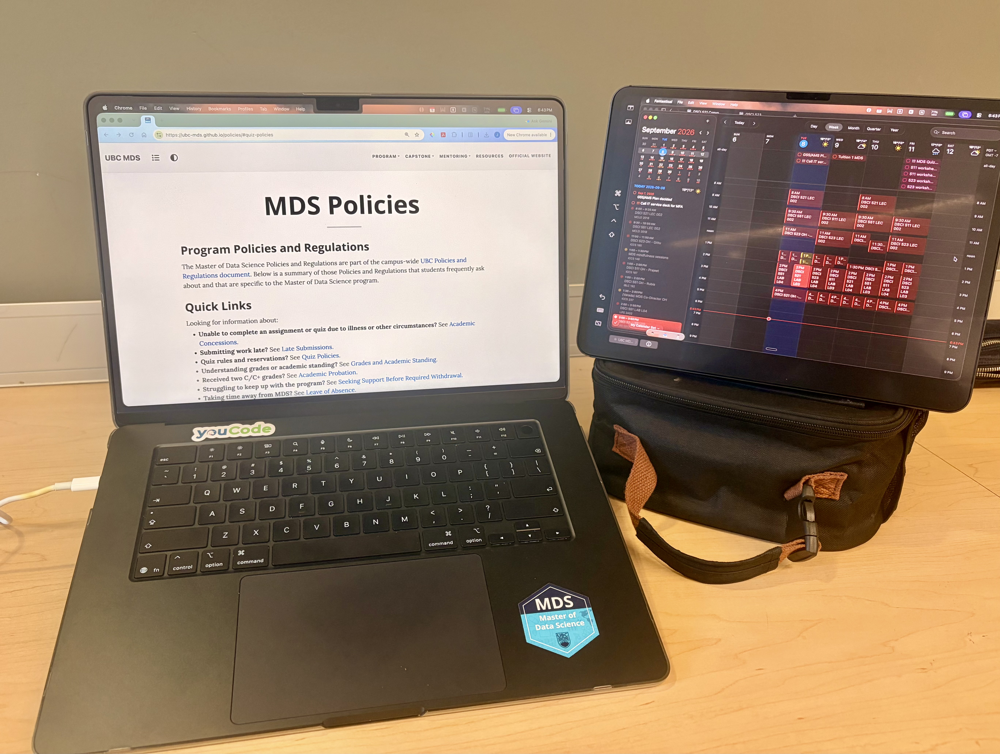

My first week in the MDS program was mainly about getting oriented to the program, the schedule, and the tools we will be using throughout the year. There was a lot of information to absorb, but it was useful to see how the different courses and platforms fit together.  

One thing that stood out to me was how intensive and structured the program is. Even in the first week, we were already working with tools such as Git, GitHub, Quarto, Python, and R, so it quickly became clear that the program would involve both technical learning and learning how to work efficiently.  

After the first few days, I started to feel more comfortable with the workflow and expectations. I am still adjusting to the pace, but I am looking forward to developing stronger programming and data science skills over the coming months.

